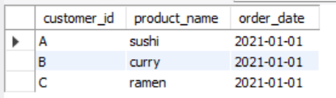
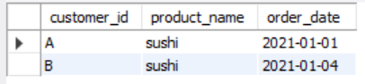
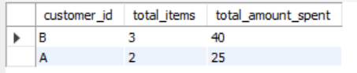
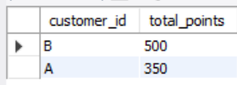
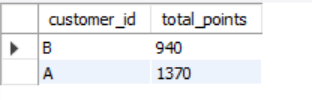

1. What is the total amount each customer spent at the restaurant?
``` sql
SELECT 
  s.customer_id,
  SUM(m.price) AS total
FROM
  sales s
JOIN
  menu m ON s.product_id = m.product_id
GROUP BY
  s.customer_id;
```

2. How many days has each customer visited the restaurant?

```sql
SELECT
  customer_id,
  COUNT(DISTINCT order_date) AS visit_days
FROM
  sales
GROUP BY
  customer_id;
```
   
3. What was the first item from the menu purchased by each customer?
``` sql
SELECT customer_id, product_name, order_date
FROM (
  SELECT 
    s.customer_id,
    m.product_name,
    s.order_date,
    ROW_NUMBER() OVER (PARTITION BY s.customer_id ORDER BY s.order_date) AS rn
  FROM sales s
  JOIN menu m ON s.product_id = m.product_id
) AS ranked_sales
WHERE rn = 1;
```
#### Output: Query 3

4. What is the most purchased item on the menu and how many times was it purchased by all customers?

``` sql
SELECT 
  m.product_name,
  COUNT(s.product_id) AS  purchase_count 
FROM  
  sales s
JOIN 
  menu m ON s.product_id = m.product_id
GROUP BY
  m.product_name
ORDER BY
  purchase_count DESC
LIMIT 1  
```

5. Which item was the most popular for each customer?
``` sql
WITH PurchaseCounts AS (
  SELECT
    customer_id,
    product_id,
    COUNT(*) AS order_count
  FROM
    sales
  GROUP BY
    customer_id, product_id
),
MaxCounts AS (
  SELECT
    customer_id,
    MAX(order_count) AS max_order_count
  FROM
    PurchaseCounts
  GROUP BY
    customer_id
)

SELECT
  pc.customer_id,
  m.product_name,
  pc.order_count
FROM
  PurchaseCounts pc
JOIN
  MaxCounts mc ON pc.customer_id = mc.customer_id AND pc.order_count = mc.max_order_count
JOIN
  menu m ON pc.product_id = m.product_id
ORDER BY
  pc.customer_id;  -- Sort by customer_id to keep them together

```

6. Which item was purchased first by the customer after they became a member?
``` sql
WITH FirstPurchases AS (
  SELECT
    s.customer_id,
    s.product_id,
    s.order_date,
    ROW_NUMBER() OVER (PARTITION BY s.customer_id ORDER BY s.order_date) AS rn
  FROM
    sales s
  JOIN
    members m ON s.customer_id = m.customer_id
  WHERE
    s.order_date >= m.join_date
)

SELECT
  fp.customer_id,
  m.product_name,
  fp.order_date
FROM
  FirstPurchases fp
JOIN
  menu m ON fp.product_id = m.product_id
WHERE
  fp.rn = 1;
```

#### Output: Query 7
7. Which item was purchased just before the customer became a member?
```` sql
SELECT customer_id, product_name, order_date
FROM (
  SELECT 
    s.customer_id,
    m.product_name,
    s.order_date,
    ROW_NUMBER() OVER (PARTITION BY s.customer_id ORDER BY s.order_date DESC) AS rn
  FROM sales s
  JOIN menu m ON s.product_id = m.product_id
  JOIN members mem ON s.customer_id = mem.customer_id
  WHERE s.order_date < mem.join_date
) AS ranked_sales
WHERE rn = 1;
````



8. What is the total items and amount spent for each member before they became a member?
```sql
SELECT 
  s.customer_id,
  COUNT(s.product_id) AS total_items, 
  SUM(m.price) AS total_amount_spent
FROM sales s
JOIN menu m ON s.product_id = m.product_id
JOIN members mem ON s.customer_id = mem.customer_id
WHERE s.order_date < mem.join_date
GROUP BY s.customer_id;
```
### Output: Query 8


9. If each $1 spent equates to 10 points and sushi has a 2x points multiplier - how many points would each customer have?
```sql
SELECT 
  s.customer_id,
  SUM(CASE
        WHEN m.product_name = 'sushi' THEN m.price * 10 * 2  -- 2x points for sushi
        ELSE m.price * 10                                    -- Regular points for other items
      END) AS total_points
FROM sales s
JOIN menu m ON s.product_id = m.product_id
JOIN members mem ON s.customer_id = mem.customer_id
WHERE s.order_date < mem.join_date
GROUP BY s.customer_id;
```
### Output: Query 9


10. In the first week after a customer joins the program (including their join date) they earn 2x points on all items, not just sushi - how many points do customer A and B have at the end of January?
```sql
SELECT 
  s.customer_id,
  SUM(CASE 
        -- If the purchase was made during the first week after joining, apply 2x points for all items
        WHEN s.order_date BETWEEN mem.join_date AND DATE_ADD(mem.join_date, INTERVAL 7 DAY)
        THEN m.price * 10 * 2
        -- Apply 2x points for sushi and regular points for others
        WHEN m.product_name = 'sushi' THEN m.price * 10 * 2
        ELSE m.price * 10
      END) AS total_points
FROM sales s
JOIN menu m ON s.product_id = m.product_id
JOIN members mem ON s.customer_id = mem.customer_id
WHERE s.order_date <= '2021-01-31'  -- Only consider purchases made in January
GROUP BY s.customer_id;
```
